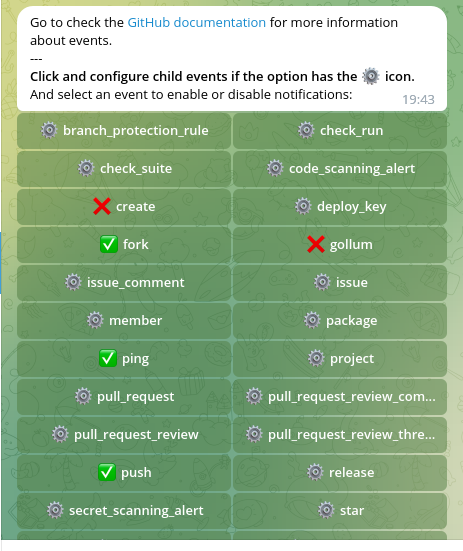

<head>
  <meta name="robots" content="index,follow" />
  <meta name="author" content="CSlant" />
  <meta name="generator" content="Docusaurus" />
  <meta name="theme-color" content="#2e8555" />
  
  <link rel="canonical" href="https://docs.cslant.com/telegram-git-notifier/prologue/features" />
  
  <meta property="og:title" content="Features of Telegram Git Notifier" />
  <meta property="og:description" content="All features of Telegram Git Notifier package for managing notifications from GitHub and GitLab. Check the features of the Telegram Git Notifier package." />
  <meta property="og:type" content="article" />
  <meta property="og:url" content="https://docs.cslant.com/telegram-git-notifier/prologue/features" />
  <meta property="og:site_name" content="Telegram Git Notifier Documentation" />
  <meta property="og:locale" content="en_US" />
  
  <meta name="twitter:card" content="summary_large_image" />
  <meta name="twitter:title" content="Features of Telegram Git Notifier" />
  <meta name="twitter:description" content="All features of Telegram Git Notifier package for managing notifications from GitHub and GitLab. Check the features of the Telegram Git Notifier package." />
  <meta name="twitter:creator" content="@cslantofficial" />
  <meta name="twitter:site" content="@cslantofficial" />
  
  <meta name="format-detection" content="telephone=no" />
  <meta name="mobile-web-app-capable" content="yes" />
  <meta name="apple-mobile-web-app-capable" content="yes" />
  <meta name="apple-mobile-web-app-status-bar-style" content="default" />
  
  <meta property="article:published_time" content="2025-07-21T00:00:00Z" />
  <meta property="article:modified_time" content="2025-07-21T00:00:00Z" />
  <meta property="article:author" content="CSlant" />
  <meta property="article:section" content="Documentation" />
  
  </head>

# 🎉 Features

You can see the list of features below.

## GitHub/GitLab Notifications to Telegram

The package allows you to configure a Telegram bot to receive notifications from various GitHub/GitLab events, including events like **commits, pull requests, issues, releases, and many more.**

## Customizable Messages and Buttons

You can customize the messages and buttons to manage the notifications from Telegram.

## Interactive Buttons

The package supports creating interactive buttons on Telegram to perform actions such as enabling or disabling notifications.

## Multiple Repositories

You can set up this webhook for different repositories. Please similarly set up the webhook for each repository.

Then every time one of those repositories appears an event, this telegram bot will immediately send you a notification.

## Support for multiple groups, channels, and users

You can add multiple chat IDs to the .env file. These chat IDs will be the chat IDs of your groups, channels, or users. Also, you can add the chat ID of this bot to receive incoming notifications for itself.

## Support for multiple topics

You can set up this webhook for different topics. Please similarly set up the webhook for each topic.

## Multiple Languages

The package supports multiple languages. You can easily add a new language or edit an existing language.

## Event Management

You can manage specific events that you want to receive notifications. Tailor your notifications to only receive alerts that matter most to you and your team. This feature ensures that you maintain focus on high-priority updates without being overwhelmed by less relevant activity.

- Support for multiple platforms: **GitHub** and **GitLab**.
- Manage event notifications separately between platforms.

