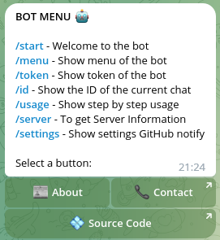

# 🤖 First test the bot

Some commands are available to test the bot.

## Start message

Now you can send a message to your bot, and you will receive a welcome message from the bot.

```textmate
/start
```

[//]: # (![start]&#40;../images/start.png&#41;)

## Menu message

To increase ease of use and reduce the need to remember commands, you can use the `/menu` command to set the menu for the bot.

```textmate
/menu
```


