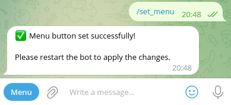

# Set menu command

To increase ease of use and reduce the need to remember commands, you can use the `/set_menu` command to set the menu for the bot.

```textmate
/set_menu
```



Now you can use the menu to manage the bot.


> **_Note:_** You must restart the telegram application to see the changes.
